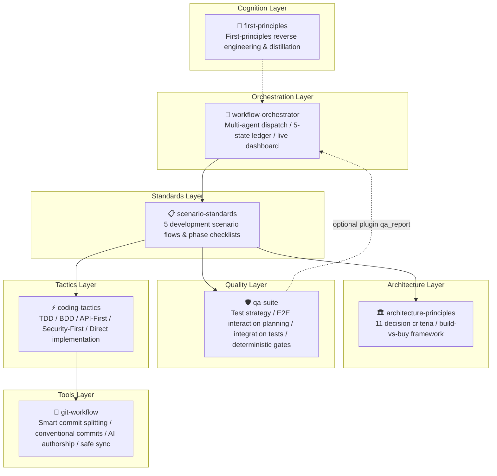

# Shipmate

> 🚀 Industrial-grade fullstack software engineering skill suite for autonomous coding agents.

Shipmate is an industrial-grade engineering capability suite designed for AI Coding Agents across multiple runtimes (OpenClaw, Claude Code, Antigravity, Cursor, Codex, OpenCode, etc.). Following rigorous software engineering discipline and the Karpathy pragmatic philosophy, Shipmate breaks the end-to-end development lifecycle into seven distinct layers: Cognition, Orchestration, Standards, Architecture, Quality, Tactics, and Tools. It enforces state-machine auditability, deterministic quality gates, and universal multi-agent runtime compatibility.

All skills adopt the open `SKILL.md` Agent Skills specification, featuring complete multi-host compatibility including native OpenClaw v1.0.0 format support.

---

## 🏛️ System Architecture



---

## 📦 Skill Suite Matrix

All skills reside directly at the root of the repository, featuring independent `SKILL.md` contracts, reference guides (`references/`), and executable scripts (`scripts/`):

| Skill Name | Layer | Core Purpose & Scope |
|---|---|---|
| **[`first-principles`](first-principles/SKILL.md)** | Cognition | Refuse assumed authority; derive complex systems from fundamental truths into verifiable mental models. |
| **[`workflow-orchestrator`](workflow-orchestrator/SKILL.md)** | Orchestration | Coordinate multi-agent delivery, maintaining an immutable 5-state machine ledger and execution flow. |
| **[`scenario-standards`](scenario-standards/SKILL.md)** | Standards | Define Greenfield, Feature, Bugfix, Refactor, and Deploy scenario disciplines with strict phase checklists. |
| **[`architecture-principles`](architecture-principles/SKILL.md)** | Architecture | Apply 11 decision criteria (benefit-first, completeness over performance, etc.) and build-vs-buy frameworks. |
| **[`qa-suite`](qa-suite/SKILL.md)** | Quality | Testing strategy, 8 boundary attack categories, failure path matrix, containerized integration, and deterministic gate scripts. |
| **[`coding-tactics`](coding-tactics/SKILL.md)** | Tactics | Micro-level coding tactics; dynamically select and execute TDD, BDD, API-First, Security-First, or Direct mode. |
| **[`git-workflow`](git-workflow/SKILL.md)** | Tools | Staged operation flows, smart staged change splitting, Conventional Commits, and AI author attribution. |

---

## 💡 Core Engineering Principles

### 1. Robust State Machine & Machine-Readable Ledgers
`workflow-orchestrator` constrains tasks within a strict 5-state machine:
```text
active ──► reviewing ──┬─► done
   ▲           │       │
   │           ▼       ▼
   └─── needs_fix   escalated
```
Every delivery artifact maintains a local JSON audit ledger recording machine-visible subskill routing (`work_item.routing`), independent multi-lens reviews (Security, Correctness, Architecture, Tests, Performance), and comprehensive evidence chains.

### 2. Deterministic Quality Gates & Decoupled Decisions
`qa-suite` replaces conversational prompt guidelines with deterministic exit codes via [`validate_qa_gate.py`](qa-suite/scripts/validate_qa_gate.py):
- **Planning Integrity**: 100% of feature-category intersections must be assessed; skipped items require documented rationale.
- **Execution Completeness**: 100% of planned tests must be executed (`planned == executed`).
- **Zero P0 Tolerance**: Any unresolved P0 defect blocks the quality gate immediately.
- **Evidence Chain**: Every failure must provide an error trace and failure screenshot.
- **Decoupled Block Handling**:
  - *Standalone Mode*: Presents failure evidence and user options (`[Fix Code]` / `[Waive Block]` / `[Update Expectation]`) without hard termination.
  - *Orchestration Mode*: Emits structured `gate_verdict: "BLOCKED"` for the orchestrator judge to determine whether to dispatch a `fixer`.
  - *Pluggable Dashboard*: Renders `qa_report` as an optional plugin; the dashboard functions with zero external dependencies when tests are absent.

### 3. Progressive Disclosure & YAGNI Simplicity
- **Context Engineering**: System prompts reference submodules (`references/*.md`) on demand, preventing context window pollution.
- **No Speculative Abstraction**: Only implement concrete code needed for the problem at hand.

---

## 🛠️ Tooling & Scripts

Shipmate includes zero-dependency Python 3 CLI utilities:

### 1. Live Workflow Dashboard
```bash
# Start the local real-time workflow dashboard (default port 8765)
python3 workflow-orchestrator/scripts/serve_workflow.py
# Access http://127.0.0.1:8765 in your browser to inspect project task swimlanes and QA reports
```

### 2. State Machine & Ledger Validator
```bash
# Run self-check on the 5-state transition table and subskill vocabulary
python3 workflow-orchestrator/scripts/validate_workflow.py self-check

# Validate a specific task ledger
python3 workflow-orchestrator/scripts/validate_workflow.py check-ledger <ledger_path.json>
```

### 3. Quality Gate Validator
```bash
# Verify the 5 quality gate scenarios via self-check
python3 qa-suite/scripts/validate_qa_gate.py self-check

# Validate a QA Report against quality gates
python3 qa-suite/scripts/validate_qa_gate.py check <qa_report.json>
```

### 4. First-Principles Document Scaffolder
```bash
# Generate a standard 5-stage first-principles mental model document
python3 first-principles/scripts/scaffold_doc.py "Async Rust Runtime"
```

---

## 📄 License

Distributed under the [MIT License](LICENSE).